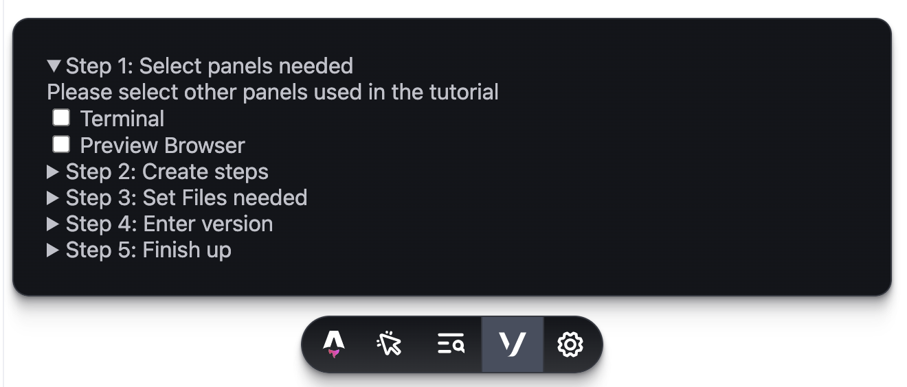
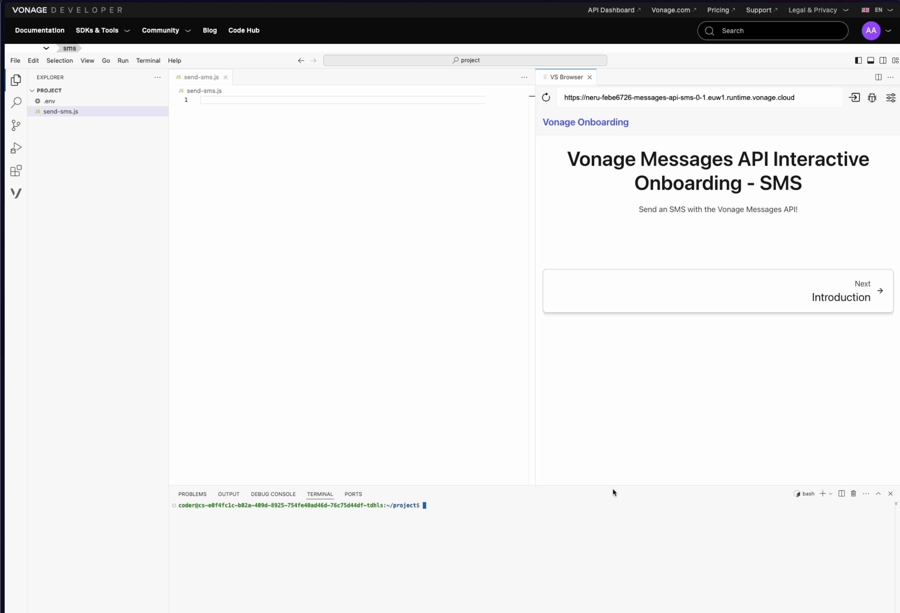
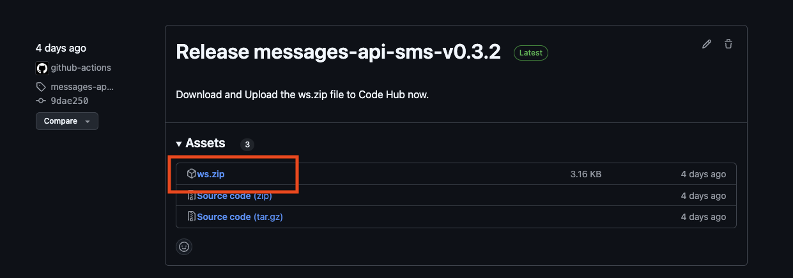

# Vonage Interactive Onboarding Tutorials

Preferred and quickest way to creating a tutorial:

[](https://stackblitz.com/fork/github/Vonage-Community/tutorial-interactive_tutorials/tree/main/toolbar-app/)

Follow the steps in the Vonage Toolbar App




## Ignore the following steps for now since we are not using Code Hub:

The repo contains the source code for Vonage Interactive Onboarding Tutorials on [Code Hub](https://developer.vonage.com/en/cloud-runtime). The onboarding tutorials provides a step by step walkthrough of Vonage APIs using Vonage Cloud Runtime Workspaces. This allows for the tutorials to be followed with the only requirement of a Vonage API account.



Interactive Onboarding Tutorials in most cases consist of a code editor on the left and a tutorial on the right and a terminal at the bottom. Tutorials that require a frontend will have an additional browser window on the right. This is all configurable by the author of the tutorial.

## Authoring a Tutorial

### Setup

Clone the repo and install dependencies from the root:

```bash
git clone git@github.com:Vonage-Community/tutorial-interactive_tutorials.git
cd tutorial-interactive_tutorials
npm install
```

### Create a New Tutorial

Run the create command from the repo root:

```bash
npm run create-tutorial
```

You will be prompted for a tutorial name. You can also pass the name directly:

```bash
npm run create-tutorial -- messages_api-node-whatsapp
```

> Keep to the tutorial name taxonomy, `product_name-language-topic`. For example a Messages API WhatsApp tutorial in Node.js would be `messages_api-node-whatsapp`.

This will scaffold a new tutorial folder under `tutorials/` with the correct structure and placeholder content.

### Edit an Existing Tutorial

Run the edit command from the repo root:

```bash
npm run edit-tutorial
```

This will show an interactive list of tutorials to choose from. You can also pass the name directly:

```bash
npm run edit-tutorial -- messages_api-node-whatsapp
```

The command will:
1. Open the tutorial folder in VS Code
2. Start the Astro dev server
3. Open `http://localhost:4321` in your browser automatically

Press **Ctrl+C** in the terminal to stop the dev server.

### Create the Tutorial Content

The tutorials are static websites built with [Astro](https://astro.build). Use `npm run edit-tutorial` from the repo root to open your tutorial and start the dev server automatically, or start it manually from your tutorial's folder:

```bash
cd tutorials/your-tutorial-name
npm run dev
```

You can now edit the tutorial content in the `src` folder. Tutorials support markdown, markdoc, and HTML. Once you are done, add a small synopsis to the README.md file in your tutorial's folder.

### Create the Tutorial Config

The final part of creating a tutorial is to create a configuration file. This allows for the Vonage Cloud Runtime Workspace to be created for you and set up with the correct panels and files you need. There is a small app in the astro development toolbar to help you generate this file. 


This will create a `tutorial-config.json` file. For example:

```json
{
  "files": [
    "send-sms.js" // The files needed for the tutorial
  ],
  "panels": [ 
    "terminal" // The panels needed. Options are "terminal" and "browser"
  ],
  "version": "1.0.0" // The version of the tutorial
}
```

> Make sure that you update the version of the tutorial in subsequent updates to the tutorial using [semver](https://semver.org) or your publishing step will fail. 

## Publishing a Tutorial

To publish your tutorial, create a PR to the repo with your changes. You can add the "Preview" label to your PR to generate a preview deploy of your tutorial. Once your PR is approved, merge it in to kick off the publishing workflow. After a few minutes a [release](https://github.com/Vonage-Community/tutorial-interactive_tutorials/releases) will automatically be created for you. This release contains a `ws.zip`. this is the zip file you need to upload to Code Hub as part of that process.



## Updating a Tutorial

To update a tutorial:

* Make changes to the `src`.
* Update the configuration file either manually or with the toolbar app.
    * Ensure the version number is updated. 
* Create a PR

The rest of the steps are the same.
