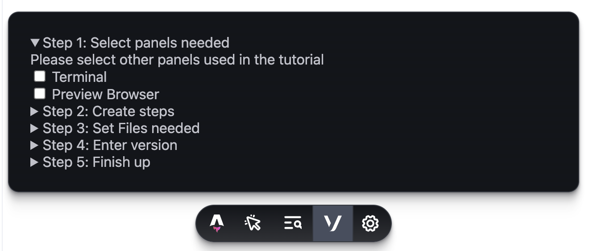

# Vonage Interactive Onboarding Tutorials

The repo contains the source code for Vonage Interactive Onboarding Tutorials on [Code Hub](https://developer.vonage.com/en/cloud-runtime). The onboarding tutorials provides a step by step walkthrough of Vonage APIs using Vonage Cloud Runtime Workspaces. This allows for the tutorials to be followed with the only requirement of a Vonage API account.


Interactive Onboarding Tutorials in most cases consist of a code editor on the left and a tutorial on the right and a terminal at the bottom. Tutorials that require a frontend will have an additional browser window on the right. This is all configurable by the author of the tutorial.

## Authoring a Tutorial

### Create Tutorial Folder

To create a new tutorial, first clone the repo:

```bash
git clone git@github.com:Vonage-Community/tutorial-interactive_tutorials.git
```

Create a copy of the starter tutorial, giving the target folder your tutorial name. Then change directory into your tutorial folder:

```bash
cd tutorials
cp -r 00_Starter-Tutorial product_name-language-topic
cd product_name-language-topic
```

> Keep to the tutorial name taxonomy, `product_name-language-topic`. For example a Messages API WhatsApp tutorial in Node.js would be `messages_api-node-whatsapp`.

### Create the Tutorial Content

The tutorials are static websites built with [Astro](https://astro.build). First install the dependencies:

```
npm install
```

Then start the development server:

```
npm run dev
```

This will start your site on your local machine. You can now edit the tutorial content in the `src` folder. Tutorials support markdown, markdoc, and HTML. Once you are done, add a small synopsis to the README.md file in your tutorial's folder.

### Create the Tutorial Config

The final part of creating a tutorial is to create a configuration file. This allows for the Vonage Cloud Runtime Workspace to be created for you and set up with the correct panels and files you need. There is a small app in the astro development toolbar to help you generate this file. 



This will create a `tutorial-config.json` file. For example:

```json
{
  "title": "Messages API - SMS (Node.js)",
  "slug": "messages_api-node-sms", // Your tutorial folder name
  "files": [
    "send-sms.js" // The files needed for the tutorial
  ],
  "panels": [ 
    "terminal" // The panels needed. Options are "terminal" and "browser"
  ],
  "version": "1.0.0" // The version of the tutorial
}
```

> Make sure that you update the version of the tutorial in subsequent updates to the tutorial using [semver](https://semver.org) or your publishing step will fail. 

## Publishing a Tutorial

To publish your tutorial, create a PR to the repo with your changes. You can add the "Preview" label to your PR to generate a preview deploy of your tutorial. Once your PR is approved, merge it in to kick off the publishing workflow. After a few minutes a [release](https://github.com/Vonage-Community/tutorial-interactive_tutorials/releases) will automatically be created for you. This release contains a `ws.zip`. this is the zip file you need to upload to Code Hub as part of that process.


## Updating a Tutorial

To update a tutorial:

* Make changes to the `src`.
* Update the configuration file either manually or with the toolbar app.
    * Ensure the version number is updated. 
* Create a PR

The rest of the steps are the same.